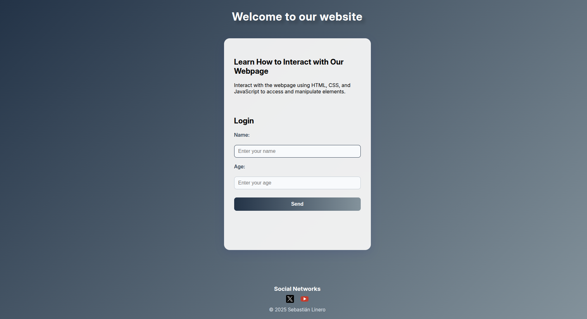

# User_Form_M3W1 - Sebastian Linero
A simple, interactive web page where users can enter their name and age.

## Description
This project features a static web page that prompts users for their name and age via a user-friendly form. It showcases the use of HTML, CSS, and JavaScript to create interactive and dynamic user experiences.

## Features
- Responsive form for name and age input
- Real-time input validation
- Personalized greeting and feedback upon submission
- Clean, modern interface with custom CSS
- Modular JavaScript for maintainability and scalability

## Repository Structure
```
user_Form_M3W1/
├── index.html  
├── README.md
├── src/
│   ├── css/
│   │   └── style.css
│   ├── img/
│   │   ├── x-logo.png
│   │   ├── youtube-logo.png
│   │   └── proyecto.png
│   └── js/
│       └── sistema_interactivo.js
```

## Getting Started

### Prerequisites
- A modern web browser (Chrome, Firefox, Edge, etc.)

### Installation
1. Clone the repository:
    ```bash
    git clone https://github.com/SlineroDC/user_Form_M3W1.git
    ```
2. Navigate to the project directory:
    ```bash
    cd user_Form_M3W1
    ```
3. Open `index.html` in your browser.

## Usage
1. Enter your name and age in the form.
2. Click 'Send' to submit.
3. View your personalized greeting and feedback.

## Screenshots

*Sample login form interface.*

## Coder Information
- **Name:** Sebastián Andres Linero De Castro
- **Clan:** Caiman
- **Email:** sebastianlinero15@gmail.com
- **ID:** 1.193.266.467
- **Training:** Module 3 JavaScript, Week 1

## License
This project is licensed under the MIT License.

## Acknowledgements
- [JavaScript Documentation in W3S](https://www.w3schools.com/js/)
- [CSS W3S](https://www.w3schools.com/css/default.asp)
- [HTML5 Specification](https://html.spec.whatwg.org/)
- [Moodle Riwi](https://moodle.riwi.io/mod/book/view.php?id=3270)
- [Media Queris](https://www.youtube.com/watch?v=yneuaVjotO8)
